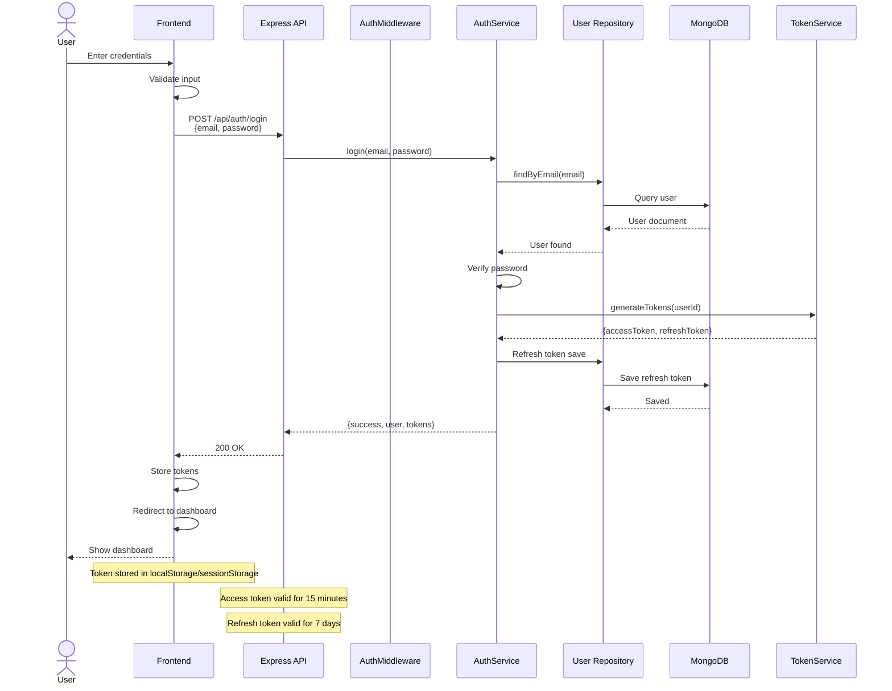
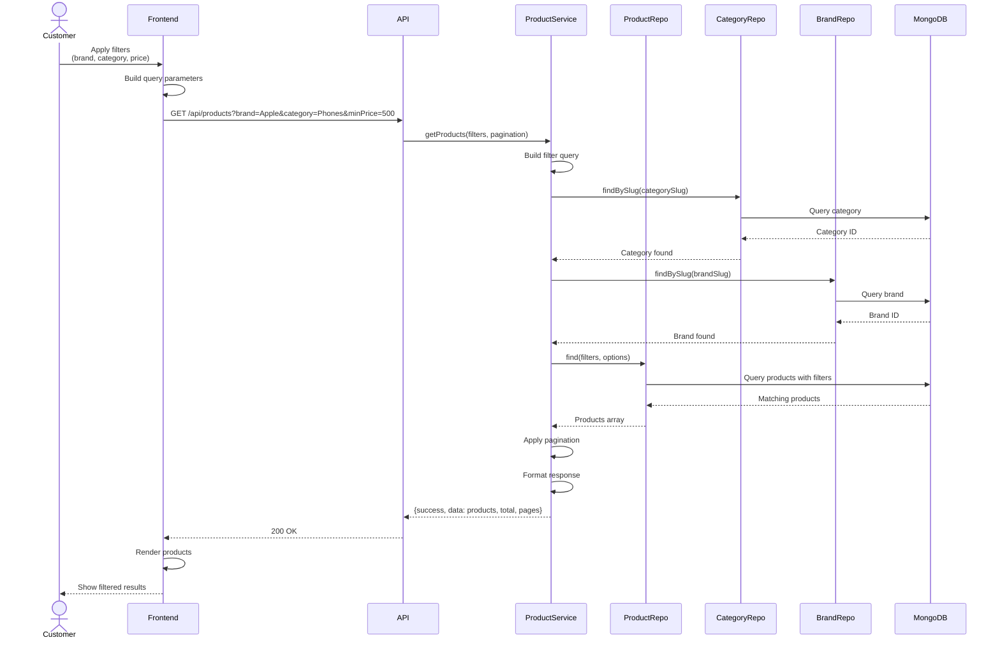
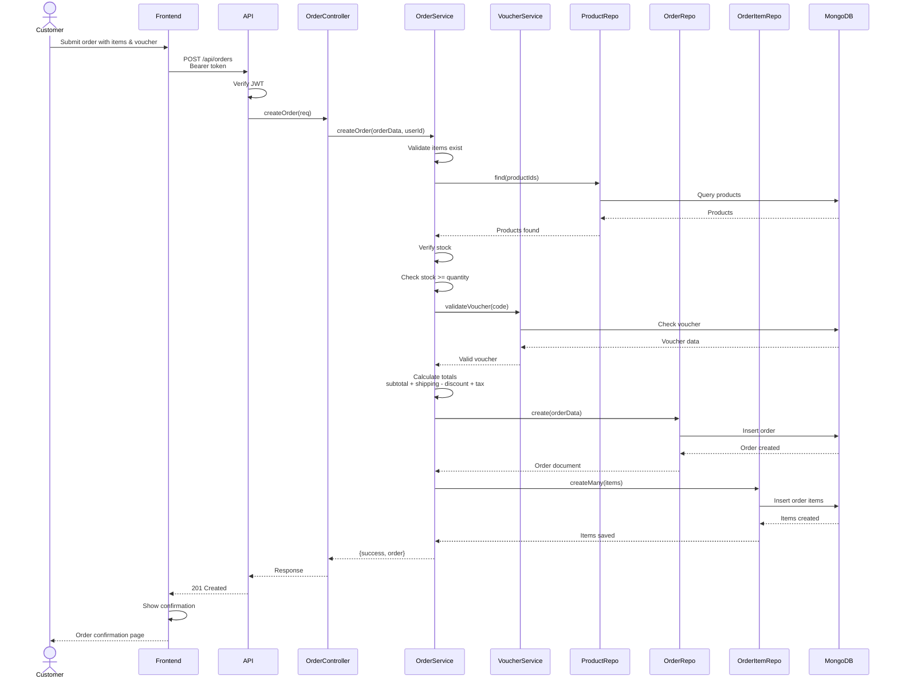
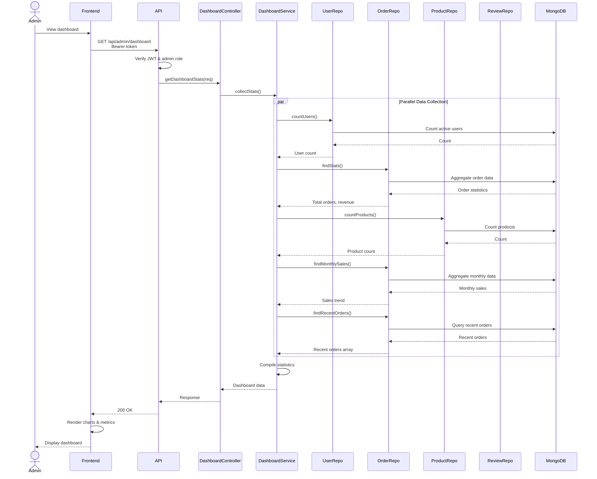
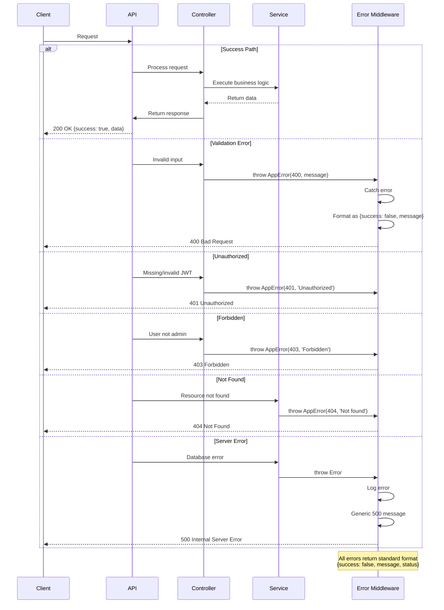

# Class & Sequence Diagrams

## Clean Architecture Class Diagram

```mermaid
classDiagram
    namespace Routes {
        class AuthRoutes {
            +POST register(req, res)
            +POST login(req, res)
            +POST logout(req, res)
            +GET me(req, res)
            +PUT profile(req, res)
            +PUT changePassword(req, res)
        }
        
        class ProductRoutes {
            +GET getProducts(req, res)
            +GET getProductById(req, res)
            +POST createProduct(req, res)
            +PUT updateProduct(req, res)
            +DELETE deleteProduct(req, res)
        }
        
        class OrderRoutes {
            +GET getOrders(req, res)
            +GET getOrderById(req, res)
            +POST createOrder(req, res)
            +PUT updateOrder(req, res)
            +DELETE deleteOrder(req, res)
            +GET lookupOrder(req, res)
        }
    }
    
    namespace Controllers {
        class AuthController {
            -authService
            +register(req, res, next)
            +login(req, res, next)
            +logout(req, res, next)
            +getMe(req, res, next)
            +updateProfile(req, res, next)
            +changePassword(req, res, next)
        }
        
        class ProductController {
            -productService
            +getProducts(req, res, next)
            +getProductById(req, res, next)
            +createProduct(req, res, next)
            +updateProduct(req, res, next)
            +deleteProduct(req, res, next)
        }
        
        class OrderController {
            -orderService
            +getOrders(req, res, next)
            +getOrderById(req, res, next)
            +createOrder(req, res, next)
            +updateOrder(req, res, next)
            +deleteOrder(req, res, next)
            +lookupOrder(req, res, next)
        }
    }
    
    namespace Services {
        class AuthService {
            -userRepository
            -refreshTokenRepository
            +register(email, password, name)
            +login(email, password)
            +logout(userId)
            +refreshAccessToken(refreshToken)
            +verifyPassword(password, hash)
            +hashPassword(password)
            +generateTokens(userId)
        }
        
        class ProductService {
            -productRepository
            -categoryRepository
            -brandRepository
            +getProducts(query, filters)
            +getProductById(id)
            +createProduct(data)
            +updateProduct(id, data)
            +softDeleteProduct(id)
            +searchProducts(query)
            +filterByCategory(categoryId)
        }
        
        class OrderService {
            -orderRepository
            -orderItemRepository
            -productRepository
            -voucherService
            +createOrder(orderData, userId)
            +getOrders(userId)
            +getOrderById(id)
            +updateOrderStatus(id, status)
            +softDeleteOrder(id)
            +lookupOrder(orderNumber, phone)
            +calculateOrderTotal(items, voucher)
        }
        
        class VoucherService {
            -voucherRepository
            +validateVoucher(code, orderValue)
            +applyVoucher(code, orderValue)
            +createVoucher(data)
            +updateVoucher(id, data)
            +softDeleteVoucher(id)
            +checkVoucherExpired(voucher)
        }
    }
    
    namespace Repositories {
        class BaseRepository {
            #model
            +find(filter, options)
            +findById(id)
            +create(data)
            +findByIdAndUpdate(id, data)
            +findByIdAndDelete(id)
            +softDelete(id)
        }
        
        class UserRepository {
            +findByEmail(email)
            +findByPhone(phone)
            +findAdmins()
            +findCustomers()
        }
        
        class ProductRepository {
            +findBySlug(slug)
            +findByCategoryId(categoryId)
            +findByBrandId(brandId)
            +search(query)
            +findBySkuOrBarcode(sku)
        }
        
        class OrderRepository {
            +findByOrderNumber(orderNumber)
            +findByUserId(userId)
            +findByStatus(status)
            +findByDateRange(startDate, endDate)
        }
        
        class VoucherRepository {
            +findByCode(code)
            +findActiveVouchers()
            +findExpiredVouchers()
        }
    }
    
    namespace Models {
        class User {
            -_id: ObjectId
            -fullName: String
            -email: String
            -passwordHash: String
            -phone: String
            -address: String
            -role: String
            -createdAt: Date
            -updatedAt: Date
            -isDeleted: Boolean
        }
        
        class Product {
            -_id: ObjectId
            -name: String
            -slug: String
            -price: Decimal
            -stock: Integer
            -categoryId: ObjectId
            -brandId: ObjectId
            -images: String[]
            -createdAt: Date
            -isDeleted: Boolean
        }
        
        class Order {
            -_id: ObjectId
            -orderNumber: String
            -userId: ObjectId
            -status: String
            -items: OrderItem[]
            -total: Decimal
            -voucherId: ObjectId
            -createdAt: Date
            -isDeleted: Boolean
        }
        
        class OrderItem {
            -_id: ObjectId
            -orderId: ObjectId
            -productId: ObjectId
            -quantity: Integer
            -unitPrice: Decimal
            -totalPrice: Decimal
        }
        
        class Voucher {
            -_id: ObjectId
            -code: String
            -type: String
            -value: Decimal
            -usageLimit: Integer
            -startDate: Date
            -endDate: Date
            -isDeleted: Boolean
        }
    }
    
    namespace Middleware {
        class AuthMiddleware {
            +authenticateToken(req, res, next)
            +verifyJWT(token)
            +attachUserToRequest(req, user)
        }
        
        class AdminMiddleware {
            +requireAdmin(req, res, next)
            +checkAdminRole(user)
        }
        
        class ErrorMiddleware {
            +errorHandler(err, req, res, next)
            +formatErrorResponse(error)
            +logError(error)
        }
        
        class ValidationMiddleware {
            +validateRequest(schema)
            +validateQuery(schema)
            +validateBody(schema)
        }
    }
    
    AuthRoutes --> AuthController
    ProductRoutes --> ProductController
    OrderRoutes --> OrderController
    
    AuthController --> AuthService
    ProductController --> ProductService
    OrderController --> OrderService
    
    AuthService --> UserRepository
    AuthService --> AuthMiddleware
    
    ProductService --> ProductRepository
    ProductService --> CategoryRepository
    
    OrderService --> OrderRepository
    OrderService --> OrderItemRepository
    OrderService --> VoucherService
    
    VoucherService --> VoucherRepository
    
    UserRepository --> User
    ProductRepository --> Product
    OrderRepository --> Order
    VoucherRepository --> Voucher
    
    BaseRepository --|> UserRepository
    BaseRepository --|> ProductRepository
    BaseRepository --|> OrderRepository
    BaseRepository --|> VoucherRepository
    
    AuthMiddleware -.->|uses| AuthService
    AdminMiddleware -.->|uses| AuthMiddleware
```

## Authentication Flow Sequence Diagram



## Product Search with Filters Sequence Diagram



## Order Creation with Voucher Sequence Diagram



## Admin Dashboard Statistics Sequence Diagram



## Error Handling Flow Sequence Diagram


