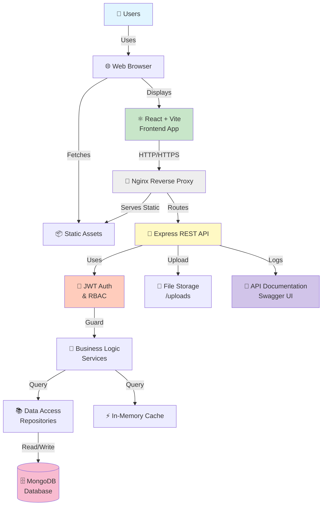
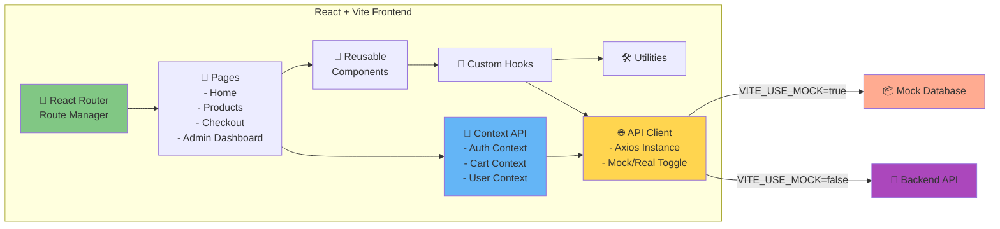
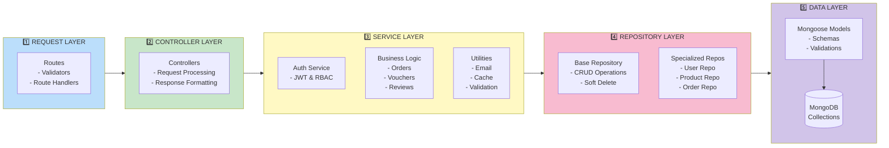
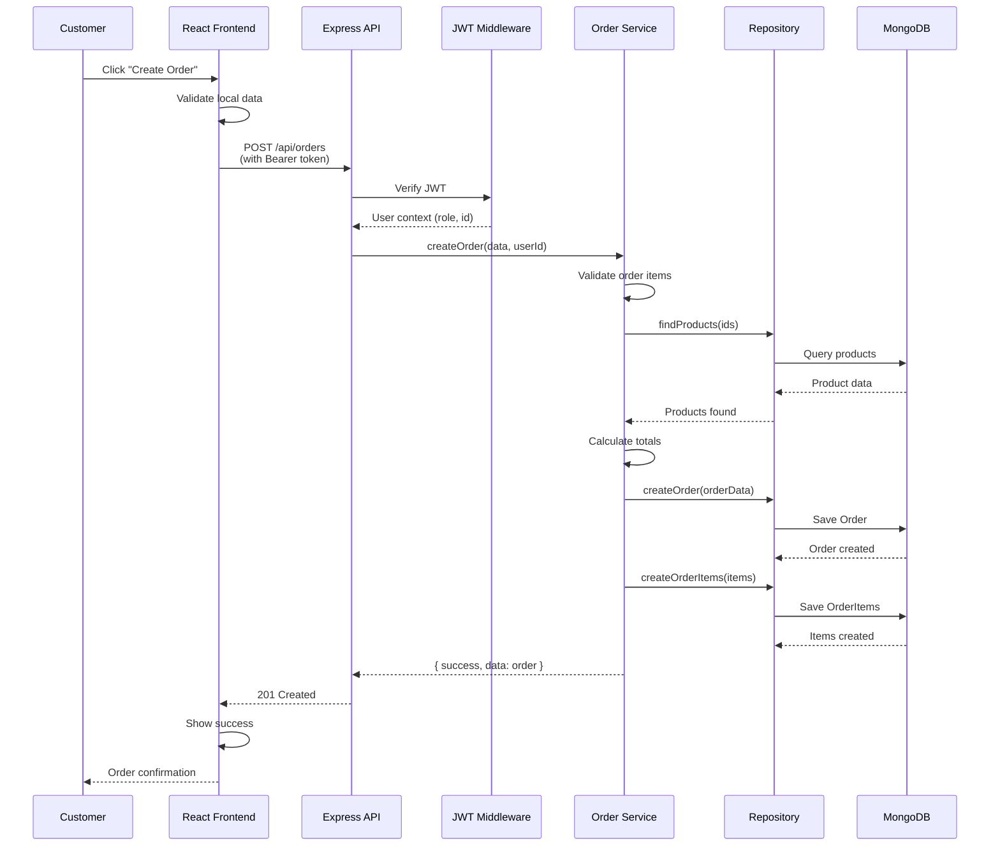
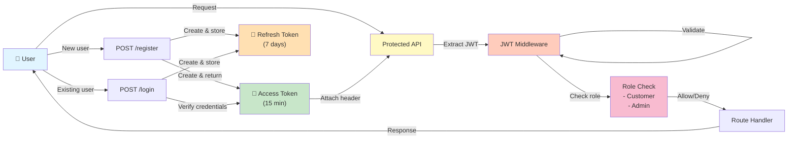
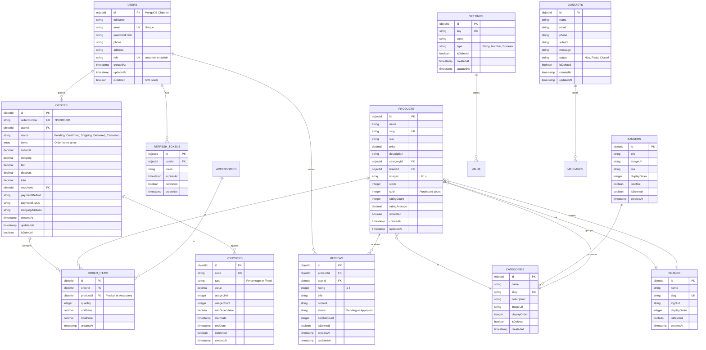
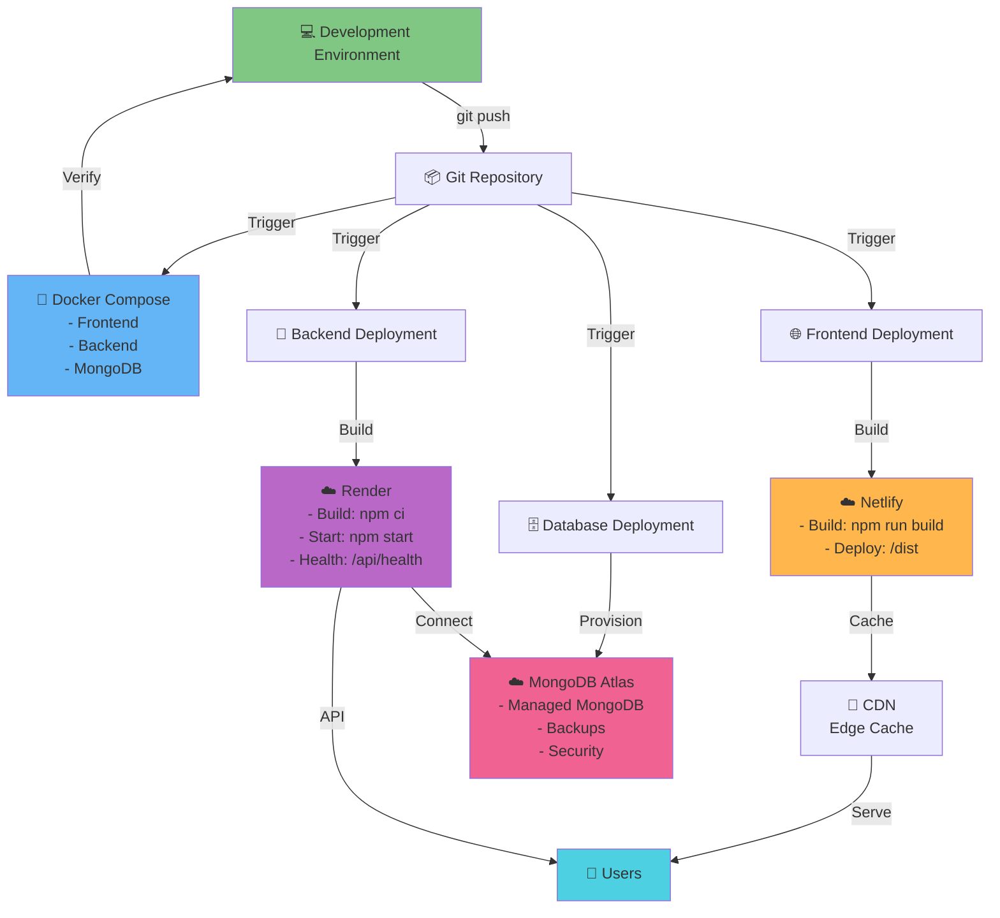
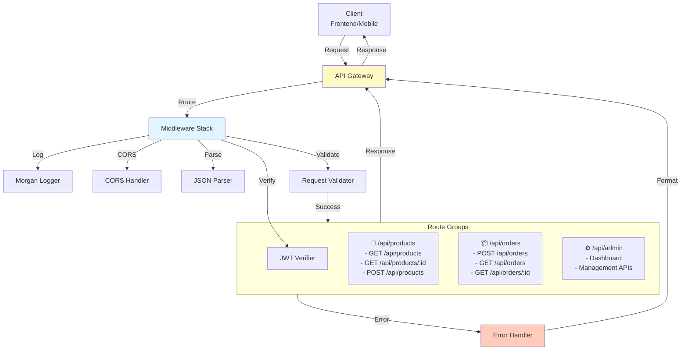

# System Architecture Diagram

## High-Level Architecture

## Frontend Architecture

## Backend Clean Architecture Layers

## Data Flow - Order Creation

## Authentication & Authorization Flow

## Database Schema Relationships

## Deployment Architecture

## API Gateway Pattern

