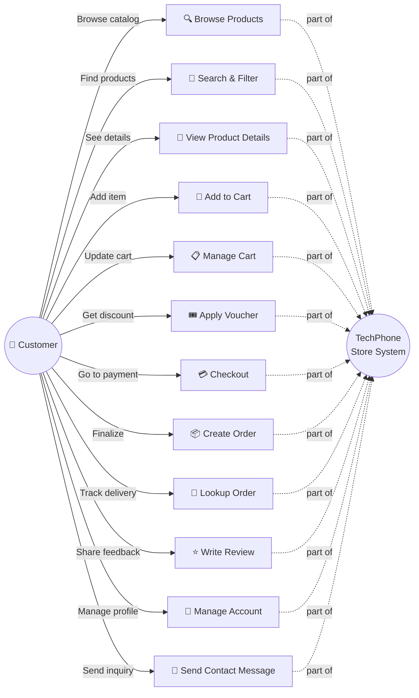
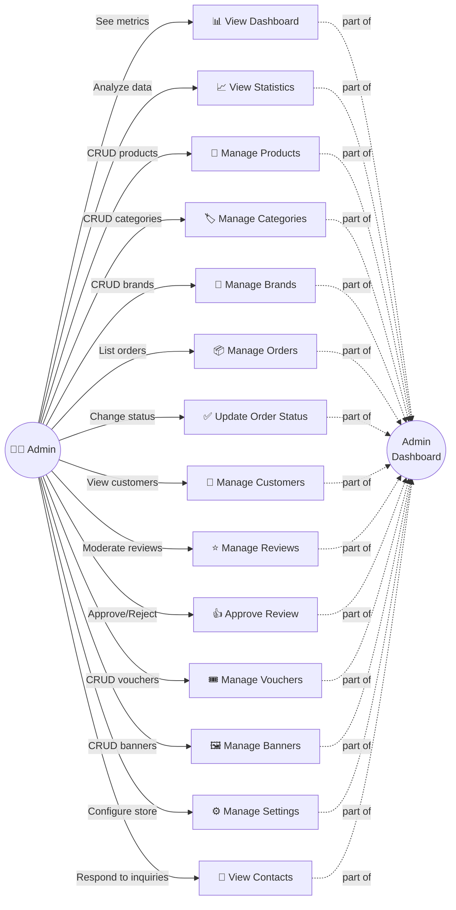
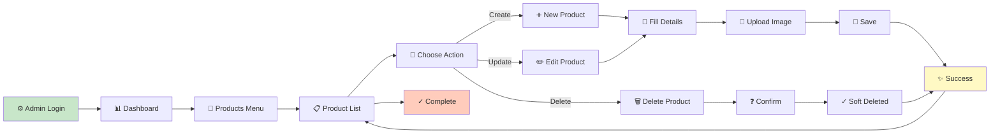
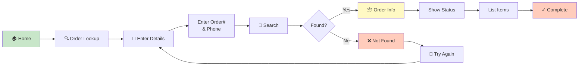
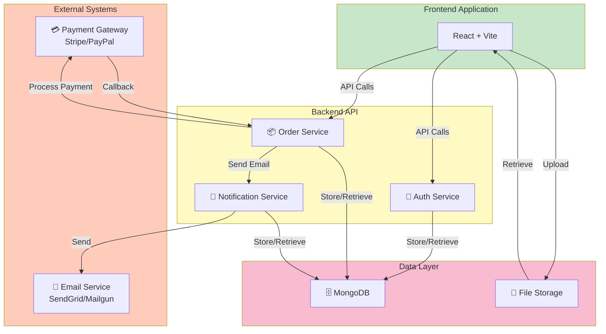

# Use Case Diagrams

## Customer Use Cases

## Admin Use Cases

## System Scenarios

### Scenario 1: Customer Product Purchase

```mermaid
graph LR
    Start["🏠 Start"] --> Search["🔍 Search iPhone"]
    Search --> Results["📱 View Results"]
    Results --> Select["Click iPhone 13"]
    Select --> Detail["📄 Product Details"]
    Detail --> AddCart["🛒 Add to Cart"]
    AddCart --> Cart["📋 View Cart"]
    Cart --> Checkout["💳 Checkout"]
    Checkout --> Voucher["🎟️ Apply Voucher"]
    Voucher --> Payment["💰 Payment Info"]
    Payment --> Submit["✅ Create Order"]
    Submit --> Success["✨ Order Created"]
    Success --> Confirm["📧 Email Confirmation"]
    Confirm --> Track["🔎 Track Order"]
    Track --> End["✓ Complete"]
    
    style Start fill:#c8e6c9
    style End fill:#ffccbc
    style Success fill:#fff9c4
    style Checkout fill:#ffe0b2
```

### Scenario 2: Admin Product Management

### Scenario 3: Order Lookup

## System Integration Points

